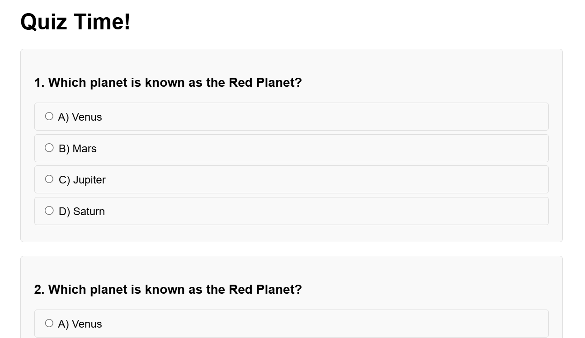

QuizApp 🎯

A simple and fun quiz application. Users can take tests in different categories and track their scores.

Features 🚀
✅ Questions from various categories
✅ Scoring system and progress tracking
✅ User-friendly interface
✅ Built with Python and Django

Installation 🛠
Follow these steps to set up and run the project:

sh
Kopyala
Düzenle
git clone https://github.com/YOUR_USERNAME/QuizApp.git
cd QuizApp
python -m venv venv
source venv/bin/activate  # On Windows: venv\Scripts\activate
pip install -r requirements.txt
python manage.py runserver
Then, open http://127.0.0.1:8000 in your browser to access the app.

Images 📸

Contributing 🤝
If you’d like to contribute:

Fork the repository 🍴
Create a new branch 🌿
Make your changes 🔨
Submit a pull request 📩
License 📜
Released under the MIT License.
